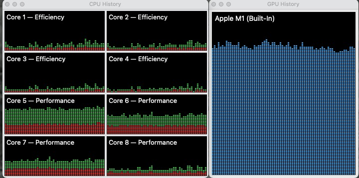

# Python Object Detection and Model Processing Using Parallel Processing
This program demonstrates the use of parallel processing for object detection and model processing tasks in Python. It leverages several libraries including OpenCV, PyTorch, and multiprocessing.

## Key Features
- Reads frames from a video source.
- Performs object detection using the YOLO model.
- Processes operations such as frame reading, object detection, and FPS calculations concurrently.
## Code Structure

### Imports
This section loads all the necessary libraries and modules.

```python
import cv2
import numpy as np
```
### YOLOProcessor Class
This class is responsible for handling the YOLO model processing.

```python
class YOLOProcessor:
    def __init__(self, frames, yolo_model, device, verbose=False):
        self.frames = frames
        self.yolo_model = yolo_model
        self.device = device
        self.verbose = verbose

    def process(self):
        while True:
            frame = self.frames.get()
            
            if frame is None:
                break

            results = self.yolo_model(frame, device=self.device, verbose=self.verbose)
            result = results[0]
            bboxes = np.array(result.boxes.xyxy.cpu(), dtype="int")
            classes = np.array(result.boxes.cls.cpu(), dtype="int")

            for cls, bbox in zip(classes, bboxes):
                (x, y, x2, y2) = bbox
                cv2.rectangle(frame, (x, y), (x2, y2), (0, 0, 225), 2)
                cv2.putText(frame, str(cls), (x, y - 5), cv2.FONT_HERSHEY_PLAIN, 2, (0, 0, 225), 2)
            cv2.imshow('YOLO Model', frame)
            
            if cv2.waitKey(1) & 0xFF == ord('q'):
                break
```
### ConcurrencyManager Class
This class is responsible for managing the parallel processing operations.

- \_\_init\_\_: This initialization method sets up the input URL, YOLO model, frame Queue, and more.
- start_stream: This method initiates the video stream and launches parallel tasks such as FPS calculation, frame display and saving, and object detection processing.
### Main Function
This is the entry point of the program. It reads the input URL, initializes a ConcurrencyManager instance, and triggers the video stream.

### Usage
Ensure Python 3.7 or higher is installed.
Install the required libraries using: pip install -r requirements.txt
Provide the URL of the video source. Store this URL in the rtsp_url.txt file.
Execute the program with python main.py
### Notes
The program is set to use a GPU by default. However, if no CUDA or MPS device is installed, it will automatically use CPU.
This program utilizes Python's multiprocessing library for parallel processing, thus care must be taken when sharing data between processes.
The program uses the YOLO v8 model by default. If a different version of the YOLO model is preferred, the model file name needs to be updated accordingly.

# Video Stream Code Structure
## Additional Classes and Functions
### VideoStream Class
This class is responsible for handling the video stream.

```python
class VideoStream:
    def __init__(self, url, frames):
        self.frames = frames
        self.url = url
        self.process = Process(target=self.capture, args=(self.frames, self.url))
        self.process.start()

    def capture(self, frames, url):
        cap = cv2.VideoCapture(url)
        error_reported = False
        while True:
            ret, frame = cap.read()
            if not ret:
                if not error_reported:
                    print("VideoCapture not opened or finished, reopening.")
                    error_reported = True
                cap.release()
                cap = cv2.VideoCapture(url)
                continue
            error_reported = False
            if not frames.full():
                frames.put(frame)

    def get_frame(self):
        if not self.frames.empty():
            return self.frames.get()

    def release(self):
        self.process.terminate()
        self.process.join()
```
### Utility Functions
These functions check the RTSP URL, read the URL from a file, calculate FPS, display FPS on the frame, and display and save the frame.

```python
def check_rtsp_url(url):
    parsed_url = urlparse(url)
    host = parsed_url.hostname
    port = parsed_url.port if parsed_url.port else 554 
    sock = socket.socket(socket.AF_INET, socket.SOCK_STREAM)
    try:
        sock.connect((host, port))
        sock.close()
        return True
    except socket.error:
        return False

def read_url_from_file(file_path='source.txt'):
    with open(file_path, 'r') as file:
        return file.readline().strip()

def calculate_fps(prev_time, fps):
    while True:
        curr_time = time.time()
        time_diff = curr_time - prev_time
        if time_diff != 0:  # Avoid divide by 0 error
            fps.value = 1 / time_diff
        prev_time = curr_time

def display_fps(frame, fps_async, fps_stream):
    cv2.putText(frame, f'Async FPS: {fps_async.value:.2f}', (10, 30), cv2.FONT_HERSHEY_SIMPLEX, 1, (0, 0, 255), 2); cv2.putText(frame, f'Stream FPS: {fps_stream.value:.2f}', (frame.shape[1] - cv2.getTextSize(f'Stream FPS: {fps_stream.value:.2f}', cv2.FONT_HERSHEY_SIMPLEX, 1, 2)[0][0] - 10, 30), cv2.FONT_HERSHEY_SIMPLEX, 1, (0, 255, 0), 2)

def display_and_save_frame(fps_async, fps_stream, frames):
    prev_time = time.time()
    while True:
        frame = frames.get()
        if frame is None:
                break
        curr_time = time.time()
        time_diff = curr_time - prev_time
        if time_diff != 0:
            fps_stream.value = 1 / time_diff
        prev_time = curr_time
        display_fps(frame, fps_async, fps_stream)
        cv2.imshow('RTSP Stream', frame)
        if cv2.waitKey(1) & 0xFF == ord('q'):
            break
```
### Usage
Follow the previous steps, and then:

- The program will automatically read the RTSP URL from a file named source.txt.
- The URL is checked to ensure it's reachable. If not, the program will report an error.
- The program will then start capturing frames from the RTSP stream and display them in a window along with the calculated FPS for asynchronous processing and the stream itself. The frames will also be put into a Queue for further processing.
- Press 'q' to stop the stream and close the window.
- Please note that the FPS calculation and display are done in separate processes to ensure they don't interfere with the main video capture and processing tasks.

### Verifying the Proper Functioning of Multiprocessing

When the multiprocessing parallel job execution is successful, there are noticeable trends observed in the computer's resource monitor. These trends reflect the efficient distribution and utilization of system resources, indicating that the program is effectively leveraging the benefits of parallel processing. The resource monitor provides crucial insights into how the system's CPU, memory, disk, and network are being utilized during the execution of the parallel tasks. By examining these trends, one can gain a better understanding of the performance characteristics of their multiprocessing application.

